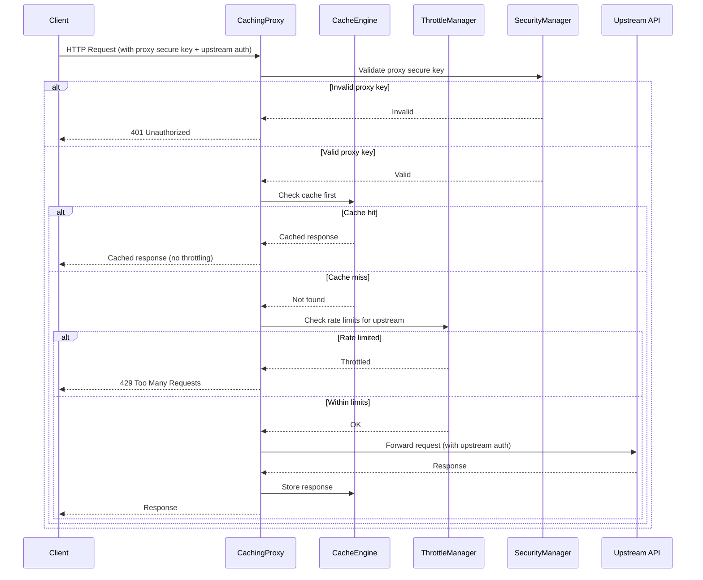
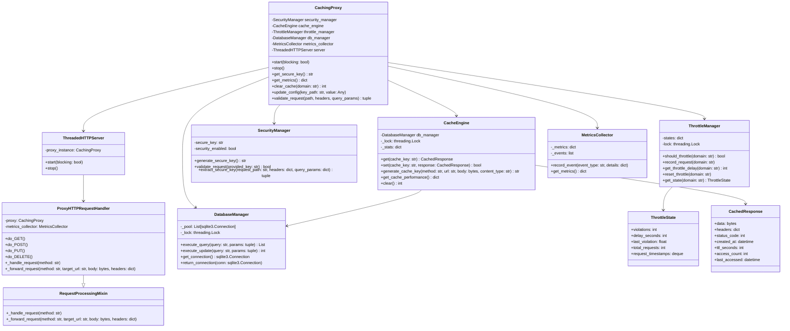

# Reference API Buddy

A Python caching proxy module designed for reference APIs where the data is non-secure and not changing frequently (ConceptNet, DBpedia, Wikidata, etc). The proxy provides configurable caching, progressive throttling, and detailed metrics to reduce API costs and prevent rate limiting. It is designed to be run on the "client" device, either embedded in a python app or standalone, and to service only specific domains through url manipulation and typically `HTTP` to `HTTPS` (`http://127.0.0.1/conceptnet/query...` -> `https://api.conceptnet.io/query...`). The URL manipulation scheme allows you to not need an `HTTP` proxy at the application level, so most traffic from your app will not pass through API Buddy. The `HTTP` -> `HTTPS` leg obviously meaningfuly shifts the security footprint for these requests, but if you need caching, this can be a lesser evil as you don't need to a) write your own custom API clients if this is only used during the dev cycle and b) ignore certs for `HTTPS` traffic in your app. So while the `HTTPS` security for the traffic to the reference sources is compromised, it leaves the rest of the traffic in your app secure. If your upstream API is highly sensitive and you think someone might be monitoring traffic on your local device, this is not for you.

Currently this doesn't function as a vanilla MITM proxy since none of the upstream sources of interest are `HTTP` and this was built specifically to avoid having to disable `HTTPS` cert validation. If you're looking for a MITM proxy, there are many out there.

## Features

- **Persistent Caching**: Persistent SQLite-based cache (in-memory or on-disk) with configurable TTL and compression
- **Progressive Throttling**: Domain-specific rate limiting with exponential backoff (applied only to upstream requests)
- **Proxy Security**: Optional secure key authentication to control proxy access
- **Upstream Pass-through**: Transparent forwarding of API keys and authentication to upstream APIs
- **Metrics Collection**: Detailed statistics on cache performance, request patterns, and throttling
- **Thread-Safe**: Built on Python's `ThreadingHTTPServer` for concurrent request handling
- **Configurable**: Flexible configuration of domains, limits, and security settings

## What It's For

While building and tuning LLM pipelines/graphs/bots and NLP pipelines there are frequently external resources available via API that are consumed as part of the pipeline that don't absolutely need to be retrieved fresh from the source of truth each time the pipeline runs. Resources like ConceptNet, DBpedia, Wikidata are amazing resources made publicly available where the data is not changing on a minute-by-minute basis, and for which it would be wonderful to reduce some of the repetititous requests made while testing software. Additionally, there are paid resources like search engines where caching results for a day or so can reduce costs without impacting the efficacy. It could also be possible to cache requests to LLMs themselves, but they mostly offer caching at the token level which is more effective and less disruptive. If you have the resources to run the reference source locally, that is still optimal, but this attempts to strike a balance where that's not feasible.

## How It Works

The basic premise is that where an API client allows the server URL to be configured, you configure `Reference API Buddy` to handle that traffic by setting the API client URL to `http://127.0.0.1/api_name/` which `Reference API Buddy` will intercept, transform the requests into an upstream URL and `POST` payload caching signature, check the cache, and forward the request if needed, storing the result for subsequent requests before returning it.

Optionally you can configure `Reference API Buddy` to use a cryptographic hash as an authorization key and include it in the URL so that only requests made with that key will be handled. The URL pattern for that is `http://127.0.0.1/api_name/secure_key`, or the key can be included in the header (see details below). If enabled, a key will be generated automatically if you don't provide one and made available through `get_secure_key()` (see detail below). If you're using this standalone and need a key, you'll want to pass one in because you'll also need to pass it into the proxy client. This obviously doesn't encrypt the traffic to the proxy, but it does authorize the traffic to ensure other software running on your system cannot untilize the proxy without your involvement. Again, if you're in a highly secure environment, this is likely not for you.

### Request Flow



## Class Hierarchy



## Installation

### For Development

```bash
git clone https://github.com/tinkermonkey/reference-api-buddy.git
cd reference-api-buddy
python -m venv .venv
source .venv/bin/activate
pip install -e ".[dev]"  # Installs with all development dependencies
```

### For Production Use

```bash
git clone https://github.com/tinkermonkey/reference-api-buddy.git
cd reference-api-buddy
python -m venv .venv
source .venv/bin/activate
pip install -e .  # Installs with production dependencies only
```

### As a Package

Publishing to PyPi is forthcoming, for now build this locally.

### For Local Testing and Building

```bash
git clone https://github.com/tinkermonkey/reference-api-buddy.git
cd reference-api-buddy
python -m venv .venv
source .venv/bin/activate
pip install -e ".[dev]"  # Includes build tools
python -m build --wheel
```

## Usage

### Basic Usage

```python
from reference_api_buddy import CachingProxy

# Configure domain mappings
config = {
    "domain_mappings": {
        "conceptnet": {
            "upstream": "https://api.conceptnet.io",
            "ttl_seconds": 7200  # Optional: 2 hours for ConceptNet
        },
        "dbpedia": {
            "upstream": "https://lookup.dbpedia.org",
            "ttl_seconds": 86400  # Optional: 1 day for DBpedia
        }
    },
    "cache": {
        "default_ttl_seconds": 43200  # 12 hours default
    },
    "server": {
        "host": "127.0.0.1",
        "port": 8080
    }
}

# Start the proxy
proxy = CachingProxy(config)
proxy.start(blocking=False)

# Make requests through the proxy
# http://localhost:8080/conceptnet/c/en/example
# http://localhost:8080/dbpedia/api/search?query=python

# Get secure key if security is enabled
secure_key = proxy.get_secure_key()
print(f"Secure key: {secure_key}")

# Stop the proxy
proxy.stop()
```

### Advanced Configuration

```python
config = {
    "domain_mappings": {
        "conceptnet": {
            "upstream": "https://api.conceptnet.io",
            "ttl_seconds": 3600  # 1 hour for frequently changing data
        },
        "wikidata": {
            "upstream": "https://www.wikidata.org",
            "ttl_seconds": 86400  # 1 day for more stable data
        }
    },
    "server": {
        "host": "127.0.0.1",
        "port": 8080
    },
    "security": {
        "require_secure_key": True,
        "secure_key": "your-secure-key-here", # Optionally pass in your own key if desired
        "log_security_events": True
    },
    "cache": {
        "database_path": "./cache.db",
        "max_cache_response_size": 10485760,  # 10MB
        "max_cache_entries": 10000,
        "default_ttl_seconds": 86400  # 1 day default for all domains
    },
    "throttling": {
        "default_requests_per_hour": 1000,
        "progressive_max_delay": 300,
        "domain_limits": {
            "conceptnet": 500,
            "wikidata": 200
        }
    },
    "logging": {
        "level": "INFO",
        "parent_logger": None, # Pass in your logger if desired
        "format": "%(asctime)s - %(name)s - %(levelname)s - %(message)s"
        "date_format": "%Y-%m-%d %H:%M:%S",
        "enable_console": True,
        "enable_file": False,
        "file_path": None,
        "max_file_size": 10485760,
        "backup_count": 5,
    }
}

proxy = CachingProxy(config)
```

### Cache-First Throttling Behavior

The proxy implements a **cache-first architecture** where caching takes priority over throttling:

```python
# Example demonstrating cache-first throttling
config = {
    "domain_mappings": {
        "api": {"upstream": "https://api.example.com"}
    },
    "throttling": {
        "domain_limits": {"api": 2}  # Very restrictive: 2 requests per hour
    }
}

proxy = CachingProxy(config)
proxy.start(blocking=False)

# First request: goes to upstream, gets cached
response1 = requests.get("http://localhost:8080/api/data")  # ✓ 200 OK (upstream)

# Second request: cache hit, bypasses throttling entirely
response2 = requests.get("http://localhost:8080/api/data")  # ✓ 200 OK (cache hit)

# Third request: same endpoint, still cache hit
response3 = requests.get("http://localhost:8080/api/data")  # ✓ 200 OK (cache hit)

# Fourth request: different endpoint, cache miss, hits throttle limit
response4 = requests.get("http://localhost:8080/api/other") # ✗ 429 Throttled (cache miss)
```

**Key Benefits:**
- **Cache hits are instant** - No throttling delays for cached responses
- **Upstream APIs are protected** - Throttling only applies to actual upstream requests
- **Better user experience** - Frequently requested data remains fast
- **Cost optimization** - Reduces upstream API usage and associated costs

### TTL (Time To Live) Configuration

The proxy supports flexible TTL configuration at both system-wide and per-domain levels:

#### System Default TTL
Configure a default TTL for all cached responses:

```python
config = {
    "cache": {
        "default_ttl_seconds": 86400  # 1 day default (24 * 3600 seconds)
    }
}
```

#### Domain-Specific TTL
Override the default TTL for specific domains based on data volatility:

```python
config = {
    "cache": {
        "default_ttl_seconds": 86400  # 1 day default
    },
    "domain_mappings": {
        "weather": {
            "upstream": "https://api.weather.com",
            "ttl_seconds": 3600  # 1 hour for weather data
        },
        "reference": {
            "upstream": "https://api.reference.com",
            "ttl_seconds": 604800  # 1 week for reference data
        },
        "news": {
            "upstream": "https://api.news.com",
            "ttl_seconds": 1800  # 30 minutes for news
        }
    }
}
```

#### TTL Behavior
- **Fallback**: Domains without specific TTL use the system default
- **Priority**: Domain-specific TTL always overrides the system default
- **Units**: All TTL values are in seconds for precise control
- **Validation**: TTL values must be positive integers

#### Example TTL Use Cases

```python
# Fast-changing data (stock prices, live feeds)
"stocks": {"upstream": "https://api.stocks.com", "ttl_seconds": 300}  # 5 minutes

# Moderate-changing data (weather, news)
"weather": {"upstream": "https://api.weather.com", "ttl_seconds": 3600}  # 1 hour

# Stable reference data (dictionaries, ontologies)
"wordnet": {"upstream": "https://api.wordnet.com", "ttl_seconds": 604800}  # 1 week

# Very stable data (historical facts, archived content)
"archive": {"upstream": "https://api.archive.com", "ttl_seconds": 2592000}  # 30 days
```

For comprehensive TTL configuration examples, see `example_ttl_config.json`. For migration from older configurations, see `documentation/02_ttl_config/02.4_ttl_migration_guide.md`.

To see TTL configuration examples in action, run:
```bash
python demo_ttl_config.py
```

### Security Examples

```python
# Example 1: No security (open proxy for development)
config_open = {
    "domain_mappings": {
        "conceptnet": {"upstream": "https://api.conceptnet.io"}
    },
    "security": {
        "require_secure_key": False  # No proxy security required
    }
}

# Example 2: Proxy security enabled (clients must provide proxy key)
config_secure = {
    "domain_mappings": {
        "openai": {"upstream": "https://api.openai.com"}
    },
    "security": {
        "require_secure_key": True,
        "secure_key": "my-proxy-secret-key" # (optional) This can be passed in or a key will be generated
    }
}

# Client requests would need the proxy key:
# curl -H "X-API-Buddy-Key: my-proxy-secret-key" \
#      -H "Authorization: Bearer sk-openai-api-key" \
#      http://localhost:8080/openai/v1/completions

# Example 3: The proxy handles both security layers independently
proxy = CachingProxy(config_secure)
proxy.start(blocking=False)

# The proxy will:
# 1. Validate the proxy secure key (if required)
# 2. Forward the upstream Authorization header to the upstream API
# 3. Cache the response for future requests with the same parameters
```

## API Endpoints

### Proxy Endpoints
- `GET/POST /{domain}/{path}` - Proxy requests to configured upstream APIs
- `GET /admin/health` - Health check endpoint

### Security

The proxy provides two levels of security:

#### 1. Proxy Access Control (Optional)
When `require_secure_key` is enabled, the proxy requires its own secure key for **all requests**. The proxy will accept the secure key via:
- **Header**: `X-API-Buddy-Key: your-proxy-key`
- **Bearer Token**: `Authorization: Bearer your-proxy-key`
- **Query Parameter**: `?key=your-proxy-key`
- **Path Prefix**: `/{your-proxy-key}/domain/path`

**Note**: The proxy validates the secure key before any caching, throttling, or forwarding occurs. If security is disabled (`require_secure_key: false`), all requests are allowed through regardless of whether a key is provided.

#### 2. Upstream API Authentication (Pass-through)
The proxy transparently forwards authentication headers and tokens to upstream APIs. Common patterns include:
- **API Keys**: `X-API-Key: your-upstream-api-key`
- **Bearer Tokens**: `Authorization: Bearer your-upstream-token`
- **Custom Headers**: Any authentication headers required by the upstream API

**Example with both security layers:**
```bash
# Request with proxy security + upstream API key
curl -H "X-API-Buddy-Key: proxy-secure-key-123" \
     -H "X-API-Key: upstream-api-key-456" \
     http://localhost:8080/conceptnet/c/en/example

# Or using path-based proxy key + upstream auth header
curl -H "Authorization: Bearer upstream-token-789" \
     http://localhost:8080/proxy-secure-key-123/wikidata/w/api.php?action=query
```

## Development Workflow

### Pre-commit Hooks

This project uses pre-commit hooks to automatically enforce code quality standards. The hooks run automatically on every commit to ensure consistent formatting and catch issues early.

#### Setup

Install the development dependencies and pre-commit hooks:

```bash
# Clone and setup the repository
git clone https://github.com/tinkermonkey/reference-api-buddy.git
cd reference-api-buddy
python -m venv .venv
source .venv/bin/activate

# Install with development dependencies (includes pre-commit)
pip install -e ".[dev]"

# Install pre-commit hooks
pre-commit install
```

Alternatively, use the Makefile shortcut:

```bash
make setup-dev  # Installs dependencies and sets up pre-commit hooks
```

#### What the Hooks Do

The pre-commit hooks automatically:
- **Format code** with Black (120-character line length)
- **Sort imports** with isort (compatible with Black)
- **Lint code** with flake8 for style and quality issues
- **Type check** with mypy (excluding test files)
- **Fix common issues** like trailing whitespace and file endings
- **Validate files** like YAML, JSON, and TOML syntax

#### Usage

Hooks run automatically on commit:

```bash
git add .
git commit -m "your changes"  # Hooks run automatically
```

You can also run hooks manually:

```bash
# Run all hooks on all files
pre-commit run --all-files

# Run specific hooks
pre-commit run black      # Format code
pre-commit run flake8     # Lint code
pre-commit run mypy       # Type check

# Format code manually (also available via hooks)
make format              # Run black and isort
make lint               # Run all linting tools
```

If hooks fail, they often auto-fix the issues. Simply re-stage the files and commit again:

```bash
git add .               # Re-stage the auto-fixed files
git commit -m "message" # Commit again
```

## Testing

```bash
# Run all tests (requires dev dependencies)
pytest

# Run specific test categories
pytest tests/unit_tests/
pytest tests/integration_tests/
pytest tests/performance_tests/

# Run with coverage
pytest --cov=reference_api_buddy

# Install dev dependencies if not already installed
pip install -e ".[dev]"
```

## Building Distribution

```bash
# Install build dependencies (included in dev dependencies)
pip install -e ".[dev]"

# Build wheel
python -m build --wheel

# Install from wheel
pip install dist/reference_api_buddy-*.whl
```

## Dependency Management

This project uses `pyproject.toml` for modern Python packaging with separated dependency groups:

### Dependency Categories
- **Production dependencies** (`dependencies`): Core runtime requirements for the proxy server
- **Development dependencies** (`[dev]`): Testing, linting, formatting, and build tools
- **Documentation dependencies** (`[docs]`): Sphinx and related documentation tools

### Installation Options
```bash
# Production only (minimal install)
pip install -e .

# Development environment (includes testing, linting, building tools)
pip install -e ".[dev]"

# Documentation building
pip install -e ".[docs]"

# Multiple groups
pip install -e ".[dev,docs]"
```

## Performance Considerations

- **Cache Compression**: Responses larger than 1KB are automatically compressed
- **Connection Pooling**: Database connections are pooled for efficiency
- **Thread Safety**: All components are designed for concurrent access
- **Memory Usage**: Configurable cache size limits and automatic cleanup
- **Cache-First Throttling**:
  - **Cache hits bypass throttling entirely** for maximum performance
  - Throttling only applies to upstream requests (cache misses)
  - This ensures cached data is served instantly regardless of rate limits
  - Reduces upstream API load and prevents unnecessary throttling delays
- **Progressive Throttling**: Exponential backoff prevents overwhelming upstream APIs

## Development Methodology

This is very much a side quest and not a day job. No deep networking or python network/http/threading stack expertise went into building this. If you possess that expertise and find imperfections, your constructive feedback is very welcome. This was built out of an end-user need that seemed to be general enough that a tool might be useful to others, and basic searching turned up MITM proxies that weren't preferable. The research was not exhaustive.

By no means does this methodology need to be followed for contributions, this is offered as an explanation or perhaps excuse for what you find before you.

As a side quest, this was also built using a little help from our robot friends, chiefly `Claude 4 Sonnet` via `Copilot`. The art of teaching the robots to take over from us is rapidly evolving, so this is offered as a snapshot and a data point.

Aside from helping guide the robots, this methodology was found to be very valueable for the Human In The Loop by forcing the process to more of a "think, analyze, act" process that might resemble a Product Development Lifecycle rather than a perhaps more reductive "build, build, build, think, start over" cycle that might be more representive of a bare SDLC.

`GPT 4.1` contributed some dreck, and some occasional value, and `Claude` and the Human In The Loop cleaned up what we could. If you find duplicate code in the same file, `GPT 4.1` can be thanked. Some of the methods attempted to prevent a large twine-ball of code from being built were:

- [.github/copilot-instructions.md](.github/copilot-instructions.md)

  - Basic guidelines to keep efforts roughly on-track, within the tech stack, and well organized

- [documentation/](documentation/)

  - The basic organization is a `[XX]_[feature name]` folder containing a finite set of requirements. `Github` issues and the `GitHub` MCP integration could of course be used instead, but your faithful Human is lagging and has not picked up that methodology yet.

    - `[XX].01_[feature]_requirements.md` contains the product requirements for this feature or feature set. This is used to ensure there is a ground truth to guide the robots.

    - `[XX].02_[feature]_design.md` contains the generated and edited design for the implementation of the feature set. This is used as both an active listening exercise to ensure the requirements are as-intended and as the technical foundation for the implementation.

    - `[XX].03_[feature]_plan.md` contains a generated implementation plan based on the design. This is used to facilitate iterative development of the design to prevent disorderly code or trying to boil the ocean with LLM usage (that has two interpretations!).

  - Workflow for [[XX].01_[feature]_requirements.md](documentation/01_poc/01.1_poc_requirements.md)

    - Here we attempt to follow some basic software development best practices and structured problem solving without becoming encumbered in process. The way this has been used is to work with non-copilot `Claude`, for this round `Claude 4.1`, to build out an idea, incorporate basic research, explore current solutions, and eventually create a (mostly) concise set of requirements. These are edited by your dear Human In The Loop while nodding on camera and pretending to listen (they can tell I'm reading by my eye movements, right?), and brought into `copilot`.

  - Workflow for [[XX].02_[feature]_design.md](documentation/01_poc/01.2_poc_design.md)

    - Once the requirements are in `copilot`, the first task is generate the design based on the tech stack outlined in [copilot-instructions.md](.github/copilot-instructions.md)

    - As mentioned above, this is used first as a feedback loop for the requirements and often times the requirements change / grow / get refined based on this design and the design is re-generated or updated.

    - The design doc is human-edited and adjusted until satisfactory, often times removing dreck and slop or over-ambitious aspirations.

  - Workflow for [[XX].03_[feature]_plan.md](documentation/01_poc/01.3_poc_plan.md)

    - The plan is used primarily to drive implementation one phase at a time, and as such, it's the most-lightly-edited aspect of this workflow. Often times `copilot` ignores the details of this plan anyway, sometimes for the better and sometimes for the worse, so the time and attention are comensurate to that.

    - `copilot` is driven through the implementation phase-by-phase using a prompt like "Implement phase 1 of the plan detailed in #01.3_poc_plan.md according to the details in the design #01.2_poc_design.md including test coverage"

    - For this round `Claude 4 Sonnet` in `Agent` mode was used for the bulk of the development with a few diversions into using `GPT 4.1` in `Agent` mode for either targetted tasks or attempts to conserve the `Premium Request` budget. Many of the `GPT 4.1` adventures ended in disaster with basic edits failing, code placed in the wrong part of the file, stupid random edits attempted. One aspiration of the detailed plan was to use `Claude 4 Sonnet` for the hard work and `GPT 4.1` for the smaller tasks, but that failed as often as it succeeded and frequently `GPT 4.1` change sets were rolled back after a frustrating 30 minutes and the task was started fresh with `Claude`.

- [documentation/copilot](documentation/copilot)

  - Claude 4 Sonnet in particular is wonderful but can be pretty verbose and seems to be incentivised to create long markdown files full of emoji. Maybe that's `copilot` innards attempting to burn down the premium budget on easy tasks. Guidance in `copilot-instructions.md` attempts to corral these files to this folder which is ignored by git. You'll have to generate your own.

## Contributing

- Be respectful, patient, and considerate

- Maintain the test coverage changes are made

- Use your robots wisely

## License

MIT License - see [LICENSE](LICENSE) file for details.

```

```
